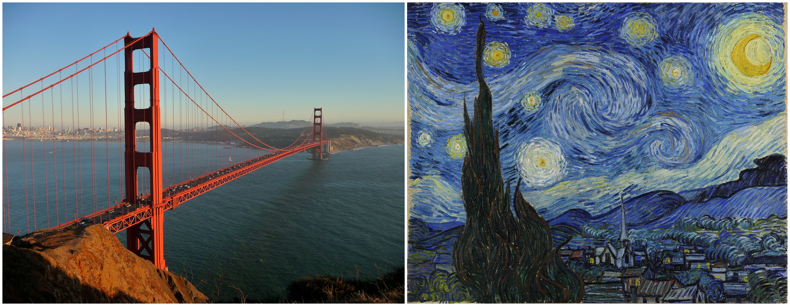
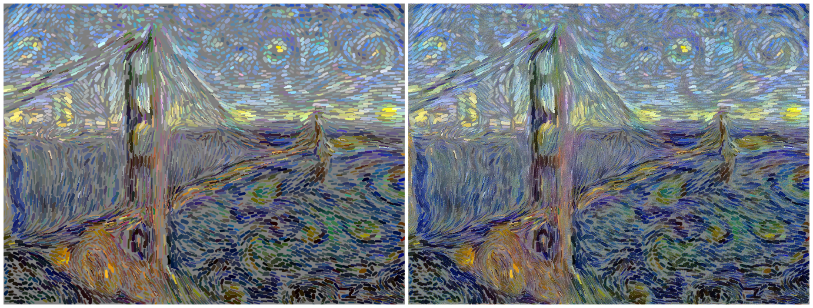

# Brushstroke Parameterized Style Transfer

<p align="center">
  <figure style="display: inline-block; margin: 5px;">
    
    <figcaption>&nbsp;&nbsp;&nbsp;&nbsp;&nbsp;&nbsp;&nbsp;&nbsp;&nbsp;&nbsp;&nbsp;&nbsp;&nbsp;&nbsp;&nbsp;&nbsp;&nbsp;&nbsp;&nbsp;&nbsp;&nbsp;&nbsp;&nbsp;&nbsp;&nbsp;&nbsp;Content Image &nbsp;&nbsp;&nbsp;&nbsp;&nbsp;&nbsp;&nbsp;&nbsp;&nbsp;&nbsp;&nbsp;&nbsp;&nbsp;&nbsp;&nbsp;&nbsp;&nbsp;&nbsp;&nbsp;&nbsp;&nbsp;&nbsp;&nbsp;&nbsp;&nbsp;&nbsp;&nbsp;&nbsp;&nbsp;&nbsp;&nbsp;&nbsp;&nbsp;&nbsp;&nbsp;&nbsp;&nbsp;&nbsp;&nbsp;&nbsp;&nbsp;&nbsp;&nbsp;&nbsp;&nbsp;&nbsp;&nbsp;&nbsp;&nbsp;&nbsp;&nbsp;&nbsp;&nbsp;&nbsp;&nbsp;&nbsp;&nbsp;&nbsp;&nbsp;&nbsp;style image</figcaption>
  </figure>

  <figure style="display: inline-block; margin: 5px;">
    
    <figcaption>&nbsp;&nbsp;&nbsp;&nbsp;&nbsp;&nbsp;&nbsp;&nbsp;&nbsp;&nbsp;&nbsp;&nbsp;&nbsp;&nbsp;&nbsp;&nbsp;&nbsp;&nbsp;&nbsp;&nbsp;&nbsp;&nbsp;&nbsp;&nbsp;10000 Brush Strokes &nbsp;&nbsp;&nbsp;&nbsp;&nbsp;&nbsp;&nbsp;&nbsp;&nbsp;&nbsp;&nbsp;&nbsp;&nbsp;&nbsp;&nbsp;&nbsp;&nbsp;&nbsp;&nbsp;&nbsp;&nbsp;&nbsp;&nbsp;&nbsp;&nbsp;&nbsp;&nbsp;&nbsp;&nbsp;&nbsp;&nbsp;&nbsp;&nbsp;&nbsp;&nbsp;&nbsp;&nbsp;&nbsp;&nbsp;&nbsp;&nbsp;&nbsp;&nbsp;&nbsp;&nbsp;&nbsp;after pixel optimization</figcaption>
  </figure>
</p>


This project is a pytorch implementation of the paper [Rethinking Style Transfer: From Pixels to Parameterized Brushstrokes](https://arxiv.org/abs/2103.17185).This paper was originally implemented in TensorFlow and reproduced in Pytorch for research purposes. Even though there is a another [pytorch implementation](https://github.com/justanhduc/brushstroke-parameterized-style-transfer), it is not accurate. The results of this repo are very close to the original paper.  

## Installation

`pip install -r requirements.txt`

## To run this code

`python main.py --content golden-gate-bridge.jpg --style starry_night.jpg --nstrokes 1000
`

images should be present in images folder

`--content` is the content image needs to be stylized

`--style` is target style image

`--nstrokes` is number of strokes you want on canvas

You can change default settings in the `main.py` file for things like canvas color, size and other hyperparameters.

## References
[Tensorflow implementation](https://github.com/CompVis/brushstroke-parameterized-style-transfer)

[Pytorch implementation](https://github.com/justanhduc/brushstroke-parameterized-style-transfer)

## Citation
```
@article{kotovenko_cvpr_2021,
    title={Rethinking Style Transfer: From Pixels to Parameterized Brushstrokes},
    author={Dmytro Kotovenko and Matthias Wright and Arthur Heimbrecht and Bj{\"o}rn Ommer},
    journal={CVPR},
    year={2021}
}
```

