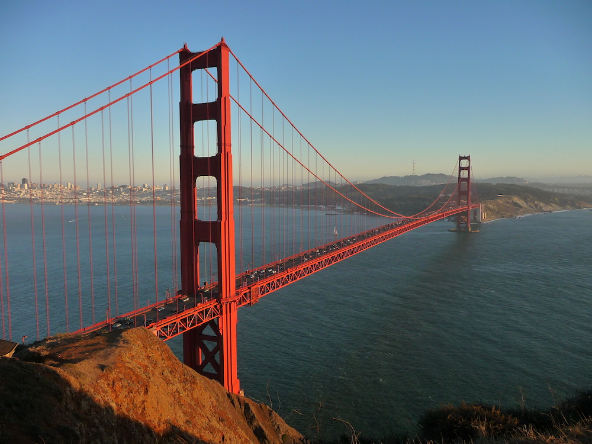
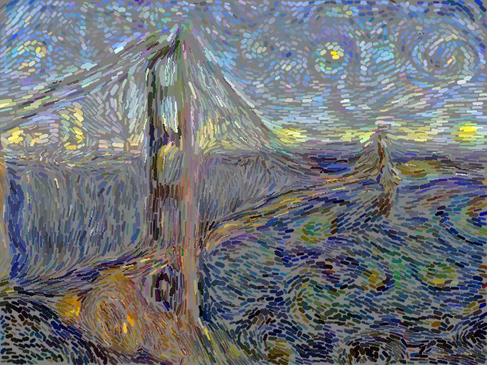
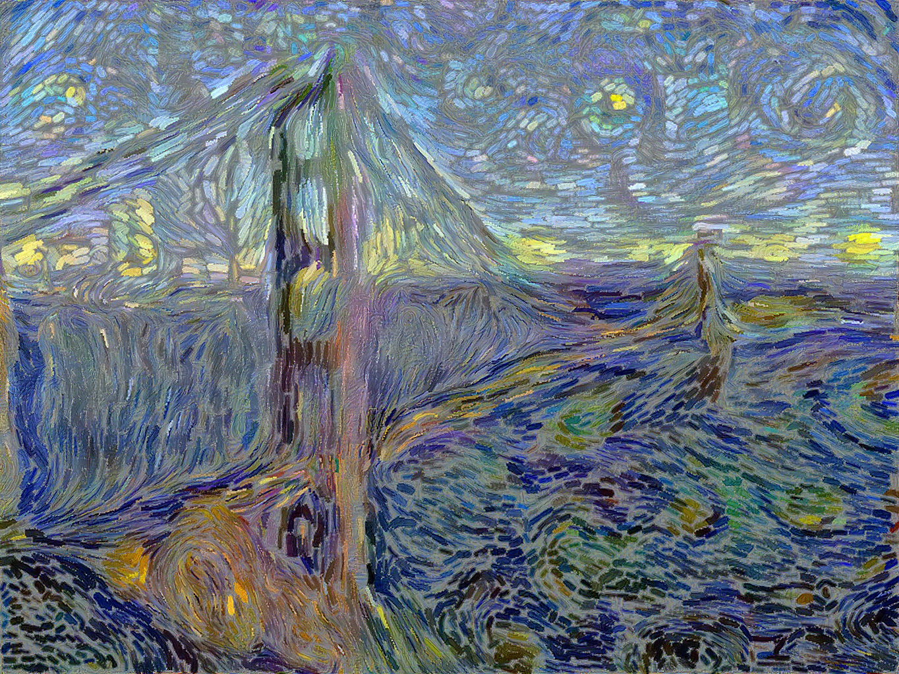

**Brushstroke Parameterized Style Transfer**

  <figure style="margin: 20px;">
    
    <figcaption>Content Image</figcaption>
  </figure>

  <figure style="margin: 20px;">
    
    <figcaption>Style Image</figcaption>
  </figure>

  <figure style="margin: 20px;">
    
    <figcaption>1000 Brush Strokes</figcaption>
  </figure>

  <figure style="margin: 20px;">
    
    <figcaption>After Pixel Optimization</figcaption>
  </figure>

This project is a pytorch implementation of the paper [Rethinking Style Transfer: From Pixels to Parameterized Brushstrokes](https://arxiv.org/abs/2103.17185)